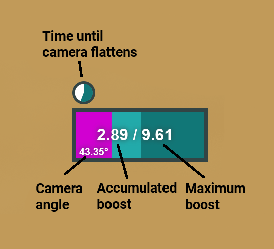

# Peksa's Fancy Flyer Tool

This tool reads and writes memory from the game Journey and visualizes various values to help with learning
or practicing [Fancy Flying](https://journey.fandom.com/wiki/Fancy_Flying)
and/or [speedrunning](https://www.speedrun.com/journey).

> [!CAUTION]
> This tool is intended for **PRACTICING** Journey speedruns or fancy flying!
> It is forbidden and considered cheating to use this tool during actual speedruns.

## Features
- Displays the current accumulated boost, straight from the game's internals.
- Displays the current camera angle in degrees from the horizon (bottom left).
- Calculates the current possible maximum boost based on the camera angle (dark cyan progress bar).
- Displays the remaining time until the camera flattens, from the game's internals (small circle).
- Optionally, estimates the current possible maximum boost based on both the camera angle and movement stick (very often incorrect!).
- Optionally, evaluates flicking based on how much the camera rises during a flick.
- Has support for "save states" (store up to 10 states per level) to help practicing a trick over and over again.

## Keyboard commands
> [!NOTE]
> Keyboard shortcuts only work with the tool in focus.

- `M` - hold M and move the mouse to move the tool. Helpful instead of trying to click and drag somewhere on the tool.
- `B` - toggle the (often incorrect!) lighter cyan max boost bar that attempts to take the wayfarer movement into consideration.
- `F` - toggle flick evaluation. When enabled a message is briefly displayed after each flick, evaluating if the flick was bad, okay or great.
- `Ctrl + 0, 1, 2, 3 ... 9` - store the current wayfarer position, boost power, scarf length & scarf charge.
- `0, 1, 2, 3 ... 9` - restore a previously stored state.

## How it works
This tool reads and writes to the memory of Journey using built-in Windows APIs:
- [OpenProcess](https://learn.microsoft.com/en-us/windows/win32/api/processthreadsapi/nf-processthreadsapi-openprocess)
- [ReadProcessMemory](https://learn.microsoft.com/en-us/windows/win32/api/memoryapi/nf-memoryapi-readprocessmemory)
- [WriteProcessMemory](https://learn.microsoft.com/en-us/windows/win32/api/memoryapi/nf-memoryapi-writeprocessmemory)

Save states are stored in `%localappdata%/PeksasFancyFlyerTool/savestates.txt`.

## Credits
Many of the pointer paths used by this tool are/or build on the work by Paleologos who
found many of these internal game values. Additionally, nathanj has helped with the pointer 
paths for the camera flattening timeouts and with testing of the tool.

---

## Developing

Requires an installed Java 23 distribution, for example 
[Amazon Corretto](https://docs.aws.amazon.com/corretto/latest/corretto-23-ug/downloads-list.html)

Run locally using `gradlew.bat run`

Package using `gradlew.bat jpackageImage` and navigate to `build/jpackage`.